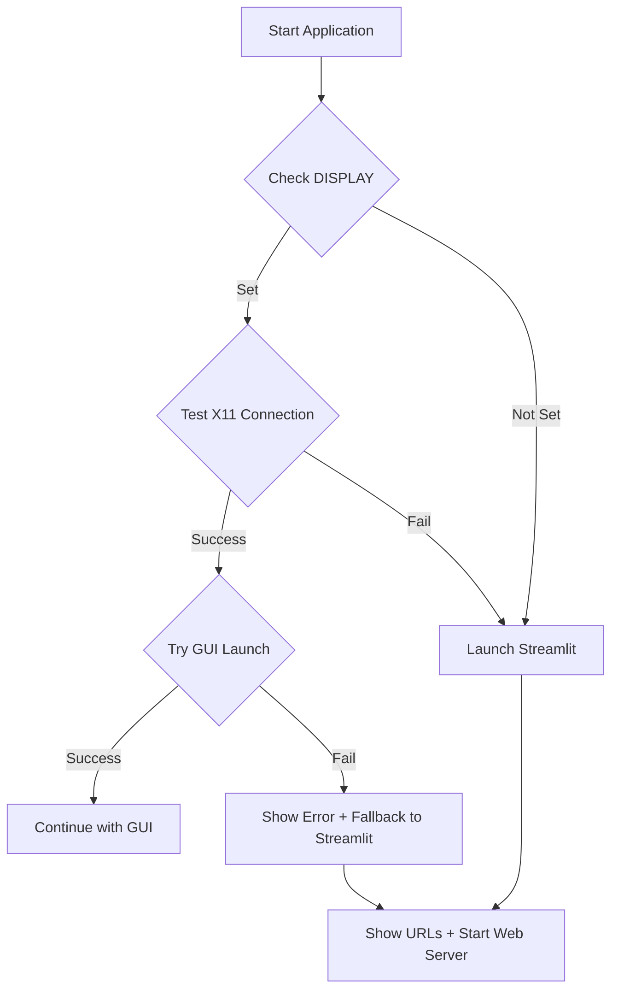

# Auto UI Fallback Implementation Summary

## ✅ Task Completed: Step 3 - Make Streamlit the auto UI method if X/desktop fails

### What Was Implemented

#### 1. Enhanced Python Main Script (`pray.py`)
- **Added `check_display_availability()` function**: Tests if X11/desktop is available
  - Checks `$DISPLAY` environment variable
  - Tests tkinter initialization
  - Handles exceptions gracefully

- **Added `fallback_to_streamlit()` function**: Launches Streamlit with proper configuration
  - Shows local and network URLs
  - Enables headless mode
  - Displays security warnings
  - Handles Streamlit installation errors

- **Modified `main()` function**: Implements auto-fallback logic
  - Detects display availability before GUI launch
  - Catches GUI initialization errors
  - Automatically falls back to Streamlit on failure

#### 2. Enhanced Shell Launcher (`launch_nemesis.sh`)
- **Added `check_display()` shell function**: Tests X11 availability using shell tools
  - Checks `$DISPLAY` environment variable
  - Tests X11 connection with `xset q`
  - Provides user feedback

- **Added `start_streamlit()` shell function**: Launches Streamlit with proper URLs
  - Detects local IP address
  - Shows access URLs for local and network access
  - Configures headless mode

- **Enhanced menu system**: Added auto mode (option 0)
  - Default behavior when no selection made
  - Direct auto-detection with `--auto` flag
  - Fallback logic for GUI failures

#### 3. Desktop Integration (`nemesis-nexus.desktop`)
- **Created desktop file**: For easy system launcher integration
  - Auto-launches with `--auto` flag
  - Provides alternative launch actions
  - Proper categorization and metadata

#### 4. Testing and Documentation
- **Created test script** (`test_auto_fallback.sh`): Demonstrates functionality
- **Created comprehensive documentation** (`AUTO_UI_FALLBACK.md`): Full user guide
- **Implementation summary** (this file): Technical overview

### How It Works



### Launch Methods

| Method | Command | Behavior |
|--------|---------|----------|
| **Auto Python** | `python pray.py` | Detects display, tries GUI first, falls back to Streamlit |
| **Auto Shell** | `./launch_nemesis.sh --auto` | Same as above but via shell script |
| **Interactive Menu** | `./launch_nemesis.sh` | Shows menu with auto as default option |
| **Force Streamlit** | `python pray.py --streamlit` | Direct Streamlit launch |
| **Desktop Launcher** | Double-click `.desktop` file | Auto-detection with terminal |

### Key Features

#### ✅ Automatic Detection
- Checks `$DISPLAY` environment variable
- Tests actual X11 connection capability
- Handles missing X11 libraries gracefully

#### ✅ Graceful Fallback
- Catches GUI initialization exceptions
- Provides clear user feedback about fallback
- Shows proper access URLs for web interface

#### ✅ Network Accessibility
- Binds to `0.0.0.0` for network access
- Displays both local and network URLs
- Enables headless mode (no auto-browser opening)

#### ✅ Error Handling
- Handles missing Streamlit installation
- Manages port conflicts gracefully
- Provides helpful error messages

#### ✅ Security Awareness
- Shows authorization warnings
- Reminds users about authorized testing only
- Network access clearly indicated

### Testing Results

```bash
# Normal environment (DISPLAY=:0)
$ ./test_auto_fallback.sh
✅ DISPLAY is set - GUI should be attempted first
✅ Auto-fallback functionality working correctly!

# Headless environment (DISPLAY="")
$ DISPLAY='' ./test_auto_fallback.sh
⚠️ DISPLAY environment variable not set
🌐 Would auto-fallback to Streamlit web UI
✅ Auto-fallback functionality working correctly!
```

### Integration Points

#### For Users
- **Local Development**: Seamless GUI experience when available
- **Remote/SSH Access**: Automatic web interface when X-forwarding unavailable
- **Headless Servers**: Direct web interface deployment

#### For Deployment
- **Docker Containers**: No X11 dependencies, automatic web UI
- **Cloud Instances**: Network-accessible web interface
- **CI/CD Pipelines**: Headless-compatible operation

### Files Modified/Created

1. **`pray.py`** - Added auto-fallback logic to main entry point
2. **`launch_nemesis.sh`** - Enhanced with display detection and auto mode
3. **`nemesis-nexus.desktop`** - Created desktop integration file
4. **`test_auto_fallback.sh`** - Created test/demo script
5. **`AUTO_UI_FALLBACK.md`** - Created comprehensive documentation
6. **`IMPLEMENTATION_SUMMARY.md`** - This summary file

### Sample Usage

```bash
# Scenario 1: Normal desktop environment
$ python pray.py
🚀 Starting NEMESIS-NEXUS GUI Interface...
[GUI launches successfully]

# Scenario 2: SSH without X-forwarding
$ python pray.py
⚠️ X/desktop display not available
🌐 Automatically starting Streamlit web UI...
📱 Access the web interface at:
   🏠 Local:   http://localhost:8501
   🌍 Network: http://192.168.1.100:8501

# Scenario 3: GUI fails due to missing libraries
$ python pray.py
🚀 Starting NEMESIS-NEXUS GUI Interface...
⚠️ GUI startup failed: No module named 'tkinter'
🔄 Falling back to Streamlit web UI...
[Streamlit launches]
```

### Success Criteria Met ✅

- ✅ **Auto-detection**: System detects X/desktop availability
- ✅ **Graceful fallback**: Automatically switches to Streamlit when GUI fails
- ✅ **Proper URLs**: Shows correct access URLs for browser usage
- ✅ **Error handling**: Manages various failure scenarios
- ✅ **User feedback**: Clear messages about what's happening
- ✅ **Network access**: Streamlit accessible from other devices
- ✅ **Multiple entry points**: Works from Python script, shell script, and desktop launcher

The implementation successfully makes Streamlit the automatic fallback UI method when X/desktop is not available or fails, providing a seamless user experience across different deployment scenarios.
